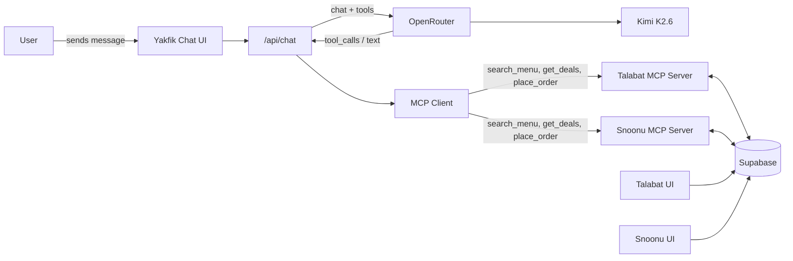
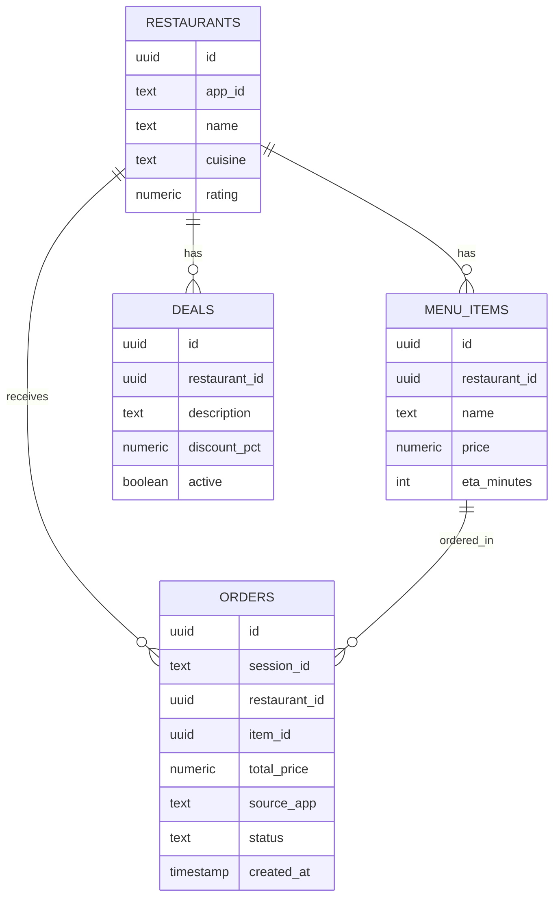
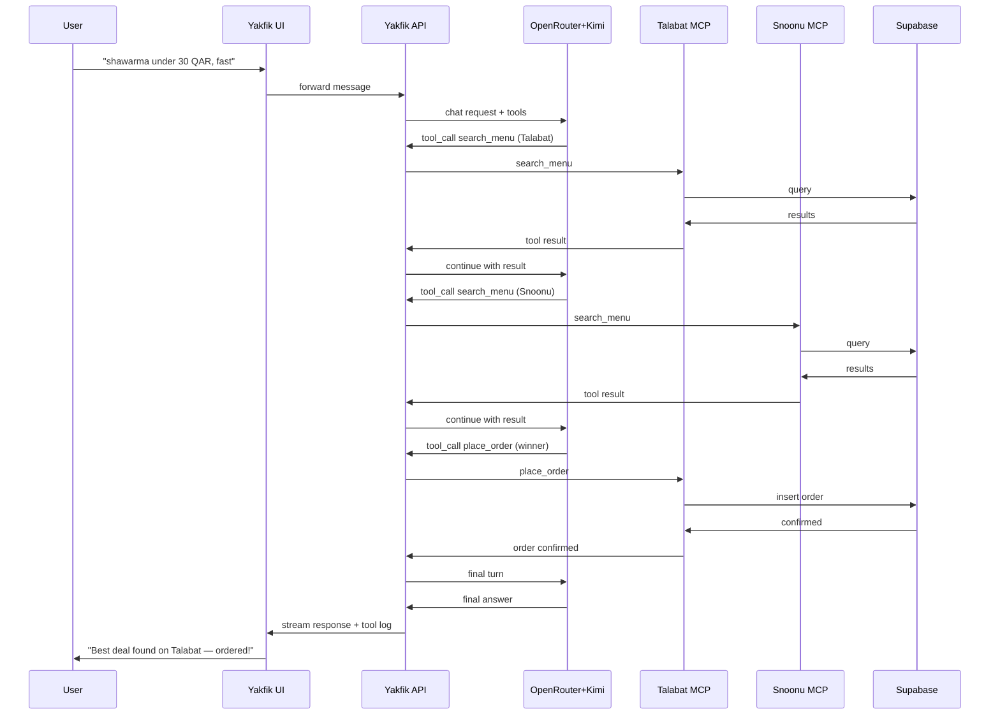
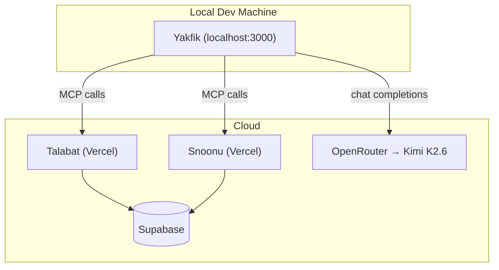

# Yakfik — System Architecture Reference

This consolidates everything discussed so far — for your team, for yourself, or to feed to an AI assistant. Sections marked **📊 DIAGRAM** include a plain-English spec plus a Mermaid version, ready to paste into a diagramming AI tool or a Mermaid renderer directly.

---

## 1. The idea, in one paragraph

**Yakfik** (يكفيك — "it's got you covered") is a conversational personal assistant that solves delivery-app overload: instead of jumping between multiple delivery apps to compare prices and deals, you tell Yakfik what you want, and it reasons across the apps on your behalf, finds the best deal, and places the order for you. Mascot: a sand cat, Qatar's native desert cat.

**MVP scope:** three linked mini-apps — Yakfik (the assistant), and two mock delivery apps (Talabat, Snoonu) with their own menus/deals, so there's something real for Yakfik to compare and order from.

---

## 2. Stack summary

| Layer | Choice |
|---|---|
| Framework | Next.js (App Router, TypeScript), one project per app, 3 sibling folders |
| Database | Supabase (Postgres) — shared project, tables scoped by `app_id` |
| AI | OpenRouter, model `moonshotai/kimi-k2.6`, routing mode **Exacto** |
| Agent/tool layer | Real MCP servers (one per mock app) via `@modelcontextprotocol/sdk`, manually orchestrated (OpenRouter has no native MCP connector — the agent loop is hand-built) |
| Deployment | Talabat + Snoonu deployed to Vercel from Day 1 (MCP servers need a public URL); Yakfik stays on `localhost` until the final demo prep |

---

## 3. 📊 DIAGRAM — High-level system architecture

**Type:** system/component architecture diagram, grouped into boxes.

**Nodes:**
- **User** (person, phone/laptop icon)
- **Yakfik App** (Next.js) — contains: Chat UI, `/api/chat` route, MCP Client
- **OpenRouter** (external API) → routes to **Kimi K2.6** (model)
- **Talabat App** (Next.js, deployed on Vercel) — contains: Browsable UI, MCP Server (`/api/mcp`)
- **Snoonu App** (Next.js, deployed on Vercel) — contains: Browsable UI, MCP Server (`/api/mcp`)
- **Supabase** (Postgres) — tables: `restaurants`, `menu_items`, `deals`, `orders`

**Edges (with labels):**
- User → Yakfik Chat UI: "sends message"
- Yakfik `/api/chat` → OpenRouter: "chat completion + tools"
- OpenRouter → Kimi K2.6: "routes request"
- OpenRouter → Yakfik `/api/chat`: "returns tool_calls / text"
- Yakfik MCP Client → Talabat MCP Server: "search_menu / get_deals / place_order"
- Yakfik MCP Client → Snoonu MCP Server: "search_menu / get_deals / place_order"
- Talabat MCP Server ↔ Supabase: "read/write, app_id='talabat'"
- Snoonu MCP Server ↔ Supabase: "read/write, app_id='snoonu'"
- Talabat UI → Supabase: "read (browse menu)"
- Snoonu UI → Supabase: "read (browse menu)"

**Mermaid:**


---

## 4. Data layer schema

```sql
restaurants ( id, app_id text, name, cuisine, rating )
menu_items  ( id, restaurant_id -> restaurants, name, price numeric, eta_minutes int )
deals       ( id, restaurant_id -> restaurants, description, discount_pct numeric, active boolean )
orders      ( id, session_id text, restaurant_id -> restaurants, item_id -> menu_items,
              total_price numeric, source_app text, status text, created_at timestamp )
```

No auth — anonymous session UUID in `localStorage` scopes orders.

## 5. 📊 DIAGRAM — Database ER diagram

**Type:** entity-relationship diagram.

**Entities & key fields:** as in the schema above.

**Relationships:**
- `restaurants` 1—* `menu_items`
- `restaurants` 1—* `deals`
- `restaurants` 1—* `orders`
- `menu_items` 1—* `orders`

**Mermaid:**


---

## 6. MCP servers

One per mock app, built with `@modelcontextprotocol/sdk`, exposed as a Next.js Route Handler at `/api/mcp`. Both expose the same tool shape, scoped to their own data:

- `search_menu({ query })` → matching items with price + eta
- `get_deals()` → active deals
- `place_order({ item_id, restaurant_id })` → writes to `orders`, returns confirmation

## 7. Yakfik's agent loop (OpenRouter + Kimi — no native MCP connector)

Since OpenRouter is OpenAI-compatible with no built-in MCP connector, the loop is hand-built in `/api/chat`:

1. MCP Client connects to both deployed MCP servers, fetches their tool lists.
2. Tool lists converted to OpenAI `tools` schema, sent to OpenRouter along with the user's message.
3. If response has `tool_calls`, execute each against the real MCP server, append result as a `tool` message, call OpenRouter again — loop until plain text comes back.
4. Stream final response + tool-call log to the UI (this is the "checking Talabat... checking Snoonu..." moment).

## 8. 📊 DIAGRAM — Order flow (sequence diagram)

**Type:** sequence diagram.

**Lifelines:** User, Yakfik UI, Yakfik API, OpenRouter+Kimi, Talabat MCP, Snoonu MCP, Supabase

**Steps:**
1. User → Yakfik UI: "shawarma under 30 QAR, fast"
2. Yakfik UI → Yakfik API: forward message
3. Yakfik API → OpenRouter+Kimi: chat request + tools
4. OpenRouter+Kimi → Yakfik API: tool_call `search_menu` (Talabat)
5. Yakfik API → Talabat MCP: `search_menu`
6. Talabat MCP → Supabase: query
7. Supabase → Talabat MCP: results
8. Talabat MCP → Yakfik API: tool result
9. Yakfik API → OpenRouter+Kimi: tool result, continue
10. OpenRouter+Kimi → Yakfik API: tool_call `search_menu` (Snoonu)
11. Yakfik API → Snoonu MCP → Supabase → back: same pattern
12. OpenRouter+Kimi → Yakfik API: decision made, tool_call `place_order` (winner)
13. Yakfik API → winning MCP server: `place_order`
14. MCP server → Supabase: insert order row
15. Supabase → MCP server → Yakfik API: confirmed
16. Yakfik API → OpenRouter+Kimi: final turn
17. OpenRouter+Kimi → Yakfik API: final natural-language answer
18. Yakfik API → Yakfik UI → User: "Found the best deal on Talabat — ordered!"

**Mermaid:**


---

## 9. 📊 DIAGRAM — Deployment map

**Type:** deployment/environment diagram, two zones ("Local Dev" and "Cloud").

**Local Dev Machine:** Yakfik app running on `localhost:3000` (`npm run dev`) — stays local through most of the build, deployed to Vercel only near the end.

**Cloud:**
- Vercel — Talabat deployment (public URL), deployed Day 1, redeployed continuously
- Vercel — Snoonu deployment (public URL), deployed Day 1, redeployed continuously
- Supabase Cloud — Postgres DB, shared by both Vercel deployments
- OpenRouter Cloud — gateway to Kimi K2.6, called by Yakfik (local or deployed)

**Edges:** Local Yakfik → OpenRouter Cloud (internet); Local Yakfik → Talabat Vercel URL (internet, MCP calls); Local Yakfik → Snoonu Vercel URL (internet, MCP calls); both Vercel apps → Supabase Cloud.

**Mermaid:**


---

## 10. 3-day build timeline & team split

| Day | Focus | Owner |
|---|---|---|
| 1 | Supabase schema + seed data; Talabat & Snoonu UIs (menu browse, deal badges); deploy both to Vercel | 2 people, one per mock app |
| 2 | MCP servers on both apps; OpenRouter agent loop in Yakfik `/api/chat`; test Kimi K2.6 tool-calling early | Whole team, MCP-loop is highest risk |
| 3 | Yakfik chat UI + sand cat mascot + "checking apps" animation; order confirmation flow; deploy Yakfik; full dry-run rehearsal | Whole team, buffer for bugs |

Natural 3-way split: one person per mock app (independent, done by end of Day 1), one person on Yakfik (builds against the two live MCP endpoints once they exist).
